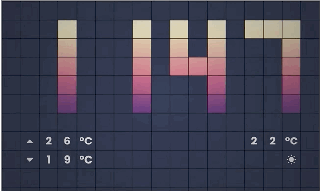

# Flipper Clock

Flipper Clock is a dynamic clock written in Flutter. It is a project by me (HSCOGT / Harry Caballeros) for the [Flutter Clock Challenge](https://flutter.dev/clock). The challenge is to create a beautiful clock UI for the Lenovo Smart Clock.

The flipper clock is composed of a grid view, in each position, there's a tile that flips accordingly to display the time; Each tile can also hold a character or an icon to display some information, in this case, the temperatures and the icon to represent the weather.

The numbers are clear, easy to read, contrasty, and spaced well, this makes it easy to read the time from longer distances and helps users with vision challenges.

> Normal Speed (The colors seem a little bit opaque in the GIFs, in reality, they are more vibrant.)



>Slow Speed


### Demo Video 

[Demo Video (Hosted on YouTube)](https://www.youtube.com)

### Development Environment

To run it, it needs to be integrated with the flutter_clock_helper module from [https://github.com/flutter/flutter_clock](https://github.com/flutter/flutter_clock).

The Flutter `stable` channel was at `v1.12.13+hotfix.5` when working on this 
project. More specifically, the following environment was used, as reported 
by the `flutter doctor -v` command:

```text
[✓] Flutter (Channel stable, v1.12.13+hotfix.5, on Mac OS X 10.14.6 18G2022, locale es-GT)
    • Flutter version 1.12.13+hotfix.5 at /Users/harrycaballeros/Developer/flutter
    • Framework revision 27321ebbad (5 weeks ago), 2019-12-10 18:15:01 -0800
    • Engine revision 2994f7e1e6
    • Dart version 2.7.0

[✓] Android toolchain - develop for Android devices (Android SDK version 29.0.2)
    • Android SDK at /Users/harrycaballeros/Library/Android/sdk
    • Android NDK location not configured (optional; useful for native profiling support)
    • Platform android-29, build-tools 29.0.2
    • ANDROID_HOME = /Users/harrycaballeros/Library/Android/sdk
    • Java binary at: /Applications/Android Studio.app/Contents/jre/jdk/Contents/Home/bin/java
    • Java version OpenJDK Runtime Environment (build 1.8.0_202-release-1483-b49-5587405)
    • All Android licenses accepted.

[✓] Xcode - develop for iOS and macOS (Xcode 11.3)
    • Xcode at /Applications/Xcode.app/Contents/Developer
    • Xcode 11.3, Build version 11C29
    • CocoaPods version 1.7.5

[✓] Android Studio (version 3.5)
    • Android Studio at /Applications/Android Studio.app/Contents
    • Flutter plugin version 39.0.3
    • Dart plugin version 191.8423
    • Java version OpenJDK Runtime Environment (build 1.8.0_202-release-1483-b49-5587405)

[✓] VS Code (version 1.41.0)
    • VS Code at /Applications/Visual Studio Code.app/Contents
    • Flutter extension version 3.7.1

```
